本系统是一个基于ssm+layui的学籍管理系统

项目代码已收录公众号【java项目源码】，需要请自行关注一下公众号并下载源码

本系统具有三种用户：

1.管理员：专业管理，班级管理，学生管理，老师管理，课程管理，开课管理以及用户管理

2.教师：成绩管理，学生查询

3.学生：选课管理，查看成绩

默认用户登陆密码：123456

所用技术：ssm+layui+jsp+echarts

CSDN博客地址：[基于ssm+layui的学籍管理系统](https://blog.csdn.net/mataodehtml/article/details/114979104)

运行视频地址：[基于ssm+layui的学籍管理系统](https://www.bilibili.com/video/BV12h411Q7Q6/)

管理员：

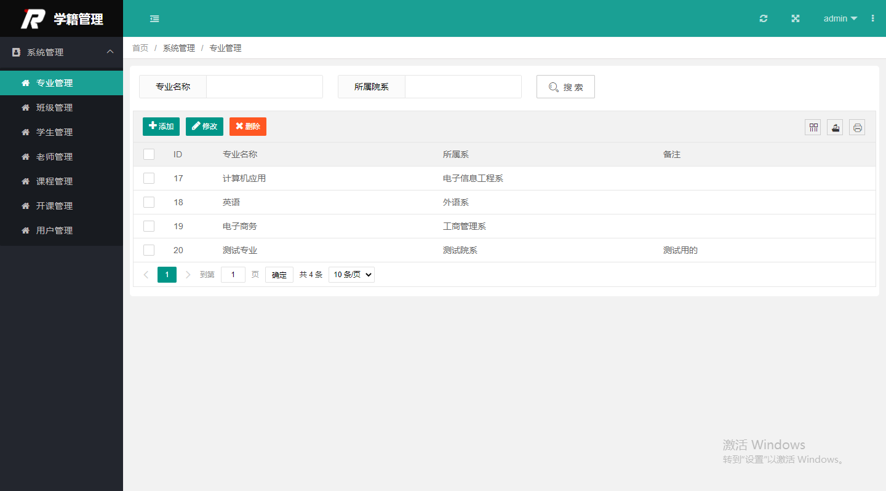

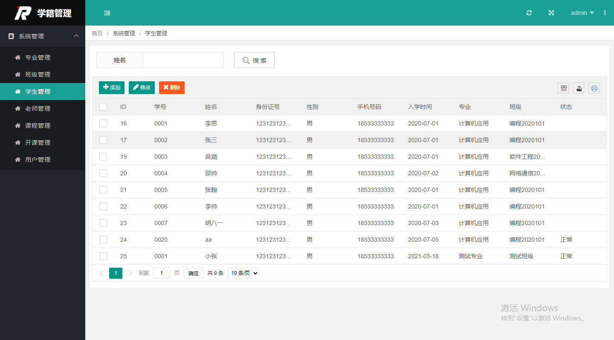

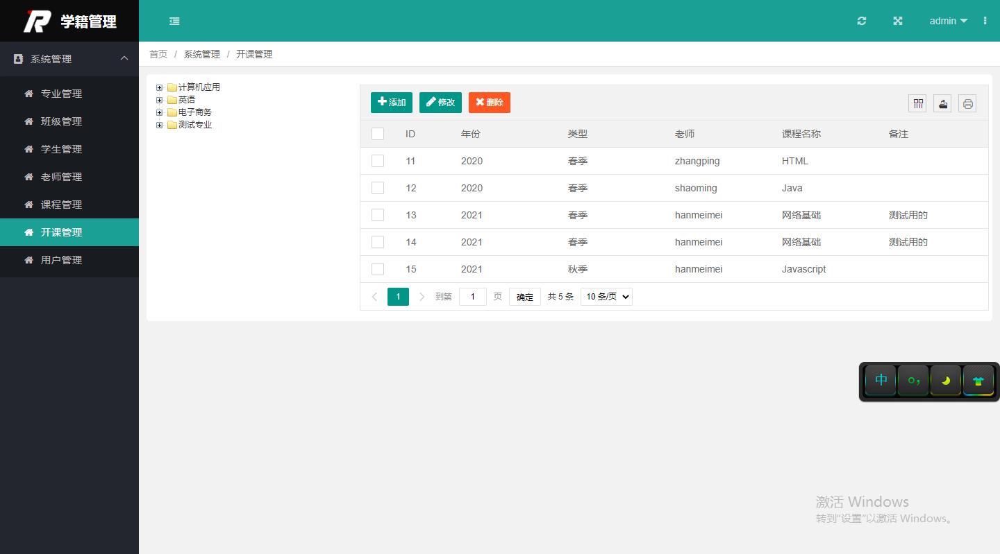

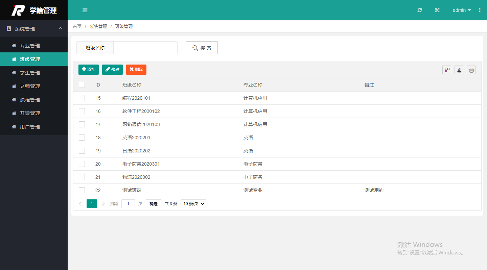

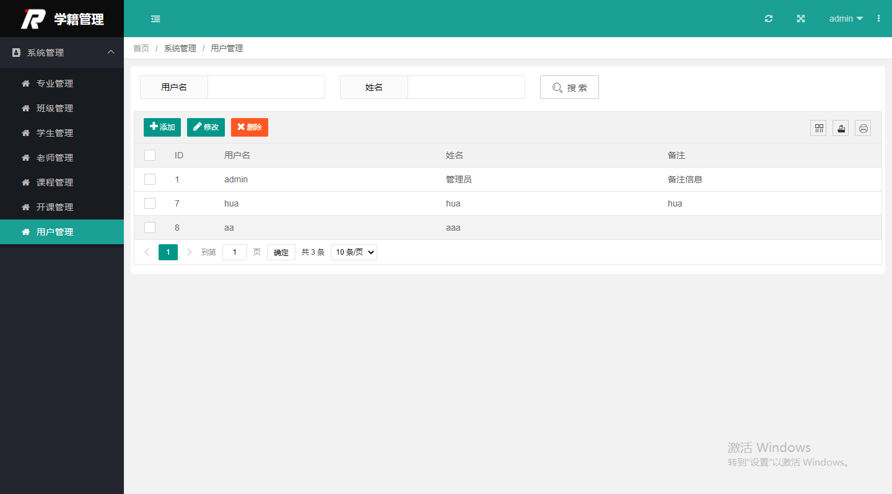

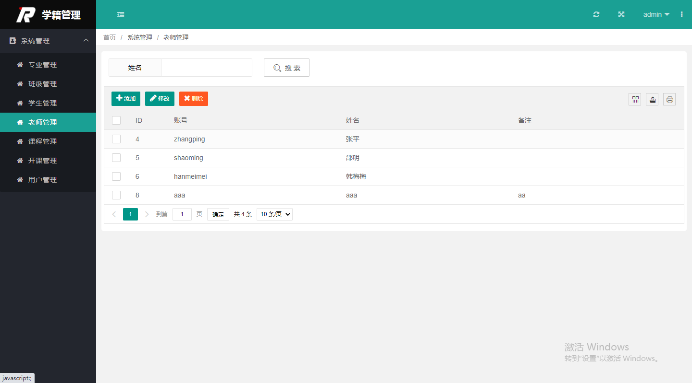

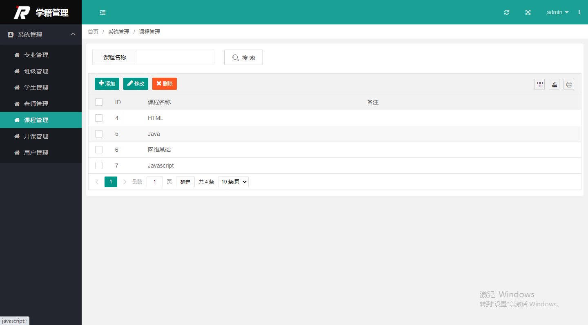

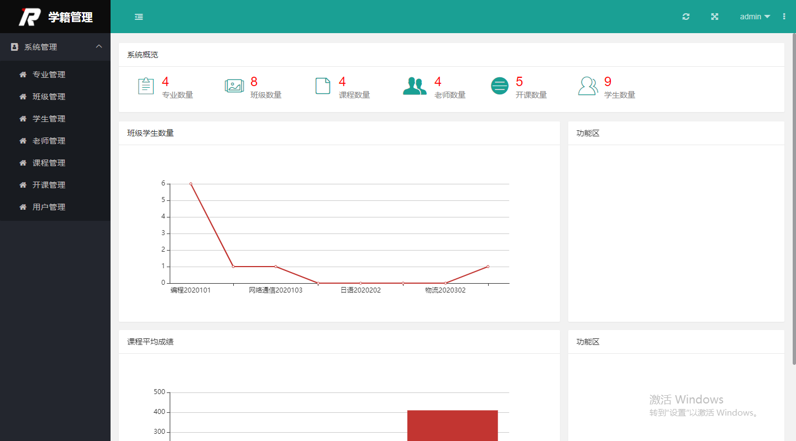

教师：

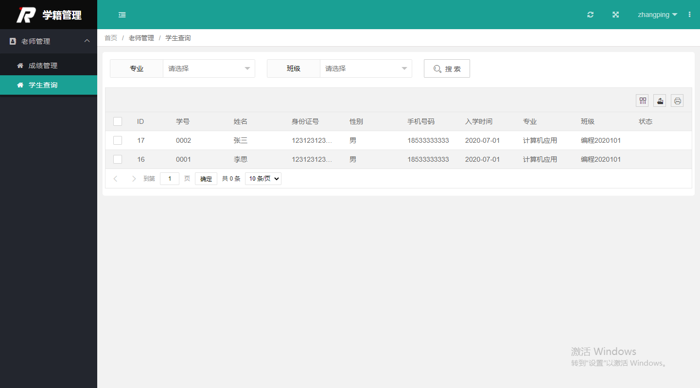

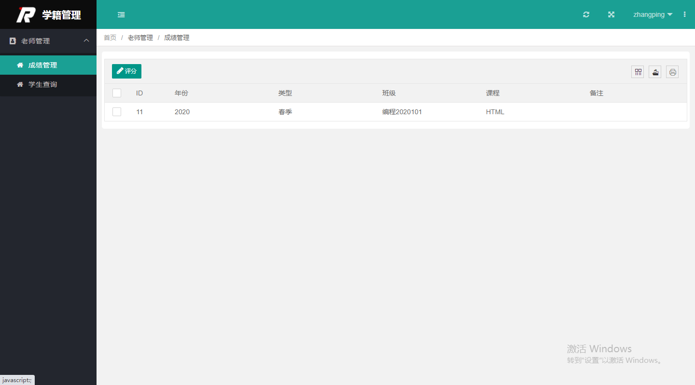

学生：

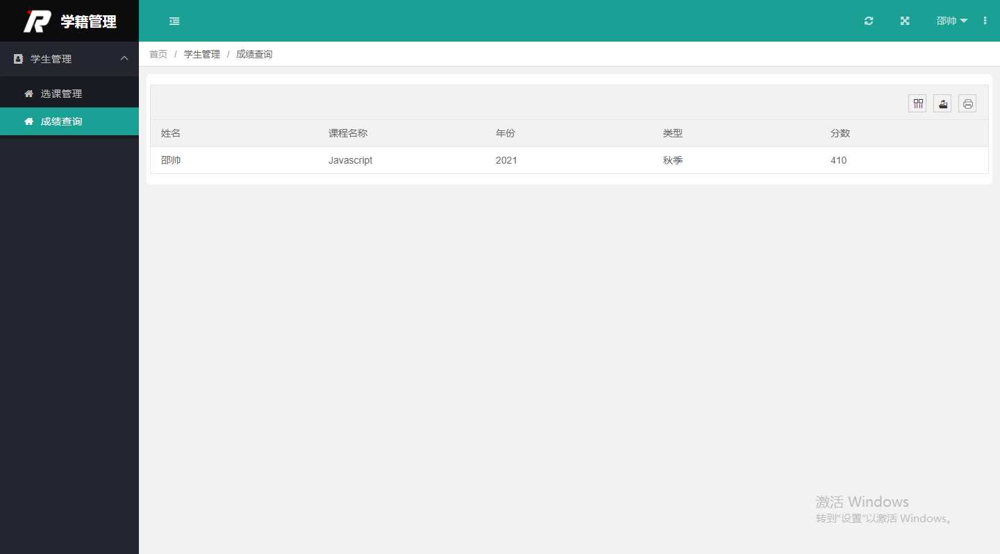

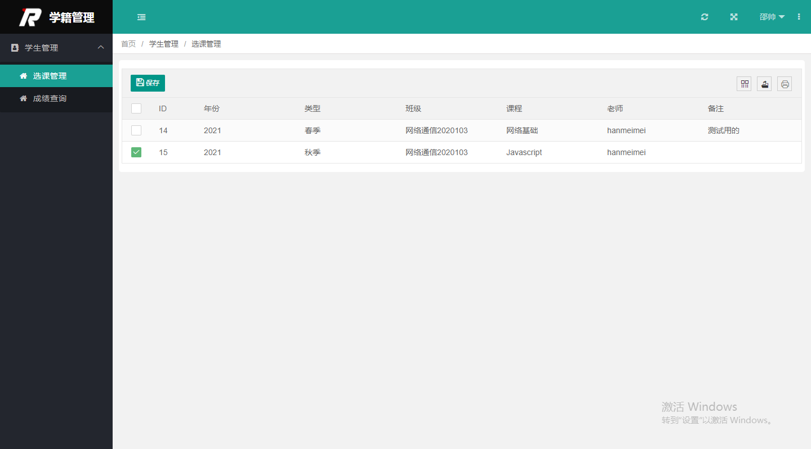

